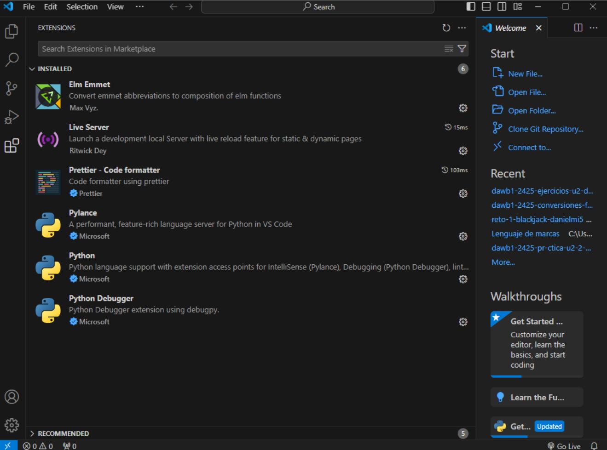
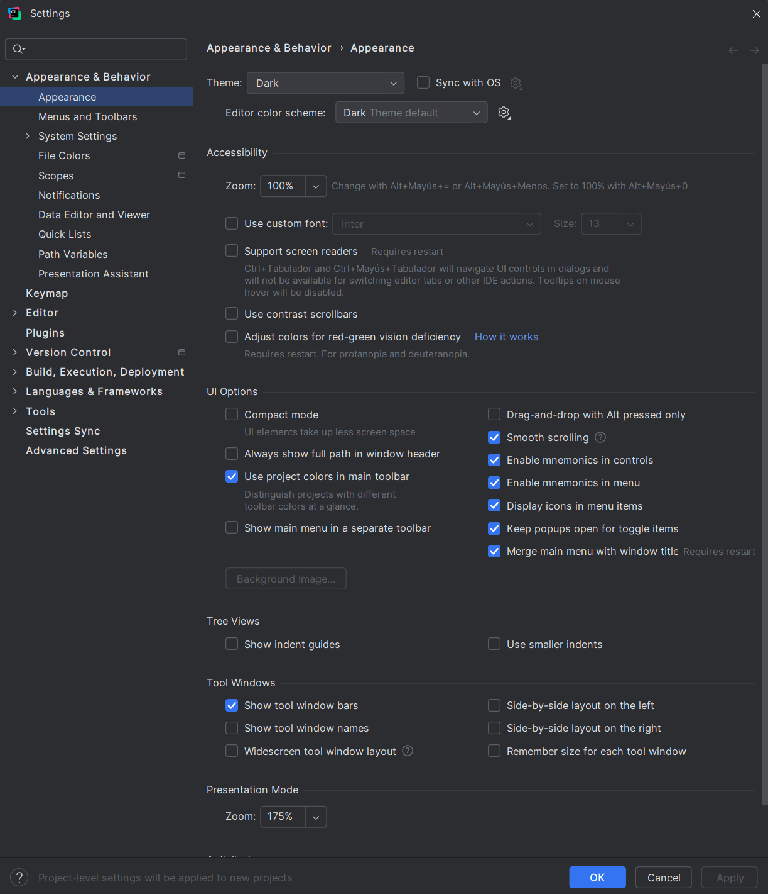
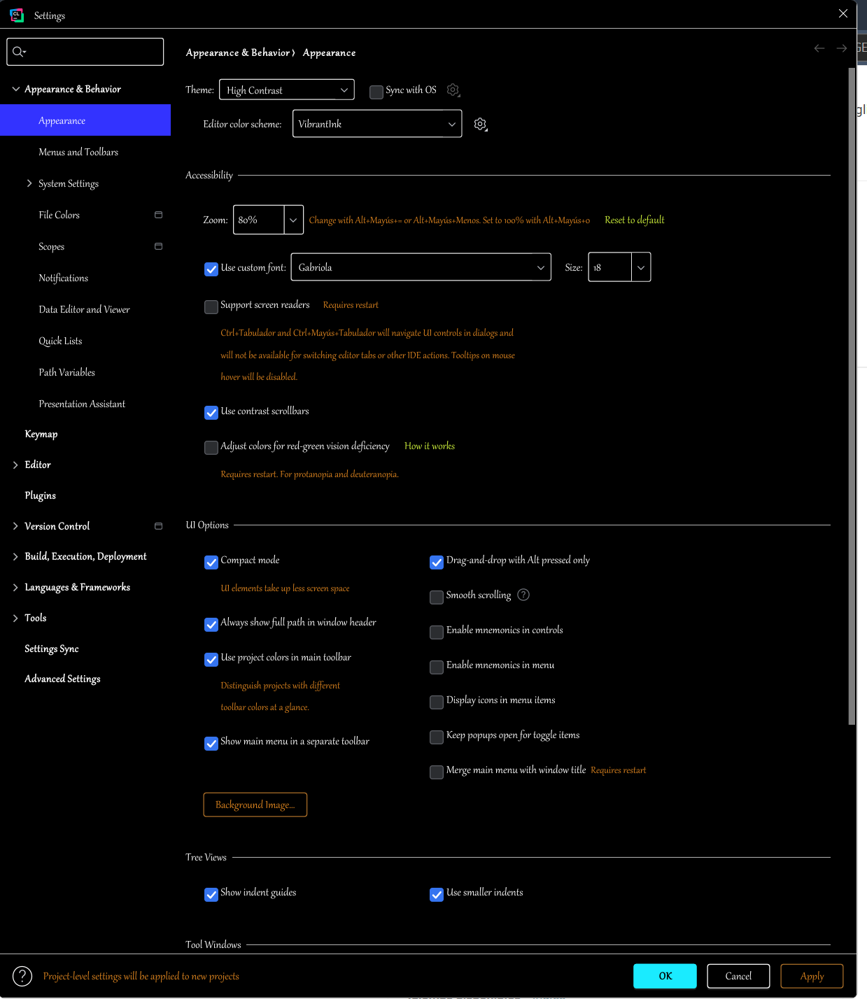

# Parte individual: Trabajo personal en los puntos 1-6

## 2.1. Instalación de entornos de desarrollo, propietarios y libres (CE 2.a)

### Tarea individual:
Elige dos entornos de desarrollo: Instala ambos en tu equipo y captura pantallas del proceso de instalación.

### Preguntas evaluativas:
- **¿Qué diferencias encontraste en el proceso de instalación entre el IDE propietario y el libre?**
- **VSC**:
  Descargado desde la página oficial. Proceso:
  - 1: Al instalar te pide aceptar el acuerdo de licencia.
    .png)
  - 2: Seleccionar las tareas adicionales que se realicen durante la instalación.
    .png)
  - 3: Seleccionar la ruta de VSC.
    .png)
  - 4: Por último, pide si abrirlo antes de finalizar. 
- **CLion**:
  Desde la página oficial he instalado **JetBrains Toolbox** y desde ahí instalé CLion. Se instala de manera directa desde la app sin necesidad de configuración adicional en la instalación, es decir, se instala directamente sin pedir nada y preparado para usar.
  .png)

  Jetbrains es más profesional ya que tiene una app con todas las herramientas para instalar y gestionar estas. La herramienta es más rápida de instalar, sin tener más procesos que realizar, aunque se pierde la parte configurable que se puede hacer en VSC en     la instalación.

  La principal diferencia es que los entornos de jetbrains están juntos en una app y VSC no.

- **¿Qué ventajas identificaste en cada uno de los entornos durante la instalación?**
- **VSC**:
  Al ser un editor ligero la instalación es bastante más rápida que otros IDEs. VSC permite elegir configuraciones personalizadas durante la instalación, como la selección de carpetas, la inclusión de extensiones y herramientas adicionales.
- **CLion**:
  La ventaja que tiene Jetbrains (CLion) es que, mediante la toolbox, tiene una interfaz para gestionar todas las herramientas de jetbrains y sus proyectos, teniendo los demás IDEs a mano. Es instalarlo y usar, ya que lo configura automáticamente (se puede configurar en la toolbox la herramienta), pero en el proceso se pierde la parte de configurar manualmente como la ruta de la carpeta y las tareas adicionales que tiene la instalación de VSC. Durante la instalación, CLion incluye automáticamente las configuraciones necesarias para trabajar con C/C++ y otros lenguajes compatibles, sin tener que realizar configuraciones manuales de compiladores o entornos de ejecución, cosa que en VSC hay que hacerlo manualmente.

  

### Evidencia:
Captura de pantalla del proceso de instalación de cada IDE.
- **VSC**: Se instala y pide si abrirlo al finalizar la instalación.
- **CLion**: Se instala directamente desde la toolbox de Jetbrains, dándole a instalar. Aparece ahí instalada y se usa directamente sin poder configurar mientras se instala como en VSC.

---

## 2.2. Gestión de módulos y extensiones en el entorno de desarrollo (CE 2.b)

### Tarea individual:
En cada IDE, agrega extensiones o módulos que amplíen su funcionalidad. Por ejemplo, suponiendo habiendo trabajado con VSC y IntelliJ IDEA, instala una extensión para trabajar con Python en Visual Studio Code o un plugin para Kotlin en IntelliJ IDEA.

### Preguntas evaluativas:
- **¿Cómo fue el proceso de instalación de extensiones o módulos en cada IDE?**
  
  - **VSC**: Ir al apartado de extensiones, aparecen las instaladas, recomendadas, etc. Se coge una extensión, se le da a instalar y ya está instalada. Añadir también, que se pueden instalar las versiones anteriores de esa extensión.
  - **CLion**: Hay plugins que son de pago (tener la licencia), por lo que se pierden muchos plugins importantes; pero tienen la mayoría un buen soporte. Para instalar, parecido a VSC, en el apartado de plugin selecciona una, instalar y ya. No es como en VSC que se podía instalar una versión específica.

- **¿Qué beneficios proporcionan las extensiones o plugins que instalaste para el desarrollo de tus proyectos?**
  
  - **VSC**:
    - **Pylance**, **Python**, **Python debugger**: Son extensiones que ayudan en el desarrollo de programas, haciendo más sencillo y rápido el desarrollo o la verificación del código Python. “Python” es una combinación de las otras dos y más extensiones. “Pylance” es un servidor del lenguaje de Python con las características de Python, como por ejemplo los docstrings y “Py Debugger” es una extensión para poder depurar los códigos de Python, y ver los fallos. Beneficia un desarrollo más cómodo y legible
    - **Elm Emmet**: Es utilizado para crear código más rápido a través de abreviaciones emmet que se convierten en funciones.
    - **Prettier**: Formatea el código para que sea más legible.
    - **Live Server**: Crea un servidor que muestra la ejecución del código en tiempo real (beneficio: poder ver los cambios en tiempo real).
  
  - **CLion**:
    - **AI Assistant**: Un asistente IA que ayuda en el desarrollo del código para que sea más cómodo y sencillo.
    - **Rust**: Un soporte para el lenguaje Rust con sus funcionalidades. También vienen instalados de forma predeterminada ya algunos plugins para creación, base de datos, etc.

### Evidencia:
Captura de pantalla del panel de extensiones o plugins instalados en cada IDE.

.png)
---

## 2.3. Personalización y automatización del entorno (CE 2.c)

### Tarea individual:
Personaliza el entorno de trabajo en cada IDE (tema, atajos de teclado) y automatiza una tarea, como la ejecución de pruebas o la compilación de código.

### Preguntas evaluativas:
- **¿Qué aspectos del entorno personalizaste y cómo mejoró tu experiencia de desarrollo?**
  
  La manera que utilizo para modificar la configuración de VSC es a través de `settings.json` y atajos en `keybindings.json`, se me hace más cómodo poder modificar desde ahí cualquier parámetro. En settings, la mayoría son aspectos visuales como el tema que es rojo, la fuenta, etc. En keybindings, son los atajos de teclado y por último, las extensiones. En Clion hay que buscar la configuración de forma tradicional por los apartados en configuración.
  
  Los aspectos visuales (tema, fuente,..) mejoran la legibilidad y como se ve el IDE. Atajos de teclado: mejora la velocidad al realizar acciones (como borrar terminal y ejecutar) y comodidad. Y por último, las extensiones son una combinación de las mejoras de las dos anteriores, mejoran el aspecto visual, el desarrollo e incluso añaden funcionalidades al IDE.

- **¿Cómo configuraste la automatización de tareas y en qué te benefició durante el trabajo?**
- **VSC**:
  Desde la opción (terminal) se puede crear la tarea y ejecutarla, se crea una task desde una plantilla (others). Dentro de `task.json` añadí la tarea. La tarea consistía en ejecutar pruebas pytest para automatizar las pruebas y aumentar la velocidad al comprobar los tests.
  .png)
- **CLion**:
  NI IDEA
  

### Evidencia:
Captura de pantalla mostrando la personalización del entorno y la automatización de tareas en cada IDE. El antes y el después.
- **Antes y después de VSC**:
  .png)
  .png)
  

- **Antes y después de CLion**:

---

## 2.4. Configuración del sistema de actualización del entorno de desarrollo (CE 2.d)

### Tarea individual:
Configura el sistema de actualizaciones automáticas o manuales en ambos IDEs para asegurarte de que están al día con las últimas versiones y mejoras.

### Preguntas evaluativas:
- **¿Cómo configuraste las actualizaciones automáticas en cada IDE?**
  
  - **VSC**: En configuración de Visual Studio Code, en el apartado de `actualizar` de aplicación, cambiando el modo a "start".
  
  - **CLion**: Como tengo la app `toolbox` de JetBrains, las actualizaciones se gestionan desde allí. En la app, en el apartado de `herramientas->configuración` aparece una opción para actualizar las herramientas de forma automática, incluso se pueden mantener las versiones anteriores de estas herramientas.

- **¿Por qué es importante mantener el IDE actualizado en proyectos de desarrollo?**
  
  Actualizar tu IDE garantiza que estés trabajando con la última versión del software, teniendo las nuevas funcionalidades que vayan introduciendo y corrección de los errores que tenga el IDE en algún momento. También se mejora la seguridad y se añaden nuevas    tecnologías compatibles.

### Evidencia:
Captura de pantalla de la configuración de actualizaciones en cada IDE.
.png)

.png)
---

## 2.5. Generación de ejecutables a partir de código fuente en distintos lenguajes en un mismo IDE (CE 2.e)

### Tarea individual:
Escribe un programa que cuente de 10 a 0 y luego imprima "¡Despegue!". Usa un solo IDE para generar y ejecutar este programa en dos lenguajes diferentes (por ejemplo, Java y Kotlin en IntelliJ IDEA).

### Preguntas evaluativas:
- **¿Cuál fue el proceso para ejecutar el mismo programa en diferentes lenguajes dentro del mismo IDE?**
  
  **VSC**:
  Para Python, haría falta instalar el intérprete para que pueda interpretar el código e instalar la extensión de Python para ejecutar el código directamente, ya que sin este VSC por sí mismo no podría ejecutar el código. Aunque, sí se podría ejecutar, si se hace en la terminal.
  
  Para Java, es necesario instalar JDK para poder desarrollar y ejecutar archivos Java. Sin una extensión, el proceso de compilado y ejecución habría que hacerlo desde la terminal. Al igual que con Python, con una extensión para Java, como fue mi caso, ese proceso se hace automáticamente mediante el botón ejecutar.

- **¿Qué diferencias encontraste en la generación del ejecutable entre los dos lenguajes?**
- **Python y java**:
  La principal diferencia es que Python, al ser un lenguaje interpretado, no genera código ejecutable. Sin embargo, Java sí genera código ejecutable. VSC, mediante la extensión, compila automáticamente los archivos `.java` y genera archivos `.class` (ejecutable que contiene el bytecode) en el mismo directorio o en una carpeta bin. Aunque esto se puede hacer desde la terminal integrada.

### Evidencia:
Captura de pantalla mostrando la ejecución del programa en ambos lenguajes dentro del mismo IDE (VSC.
  .png)
 .png)

---

## 2.6. Generación de ejecutables con diferentes IDEs a partir del mismo código fuente (CE 2.f)

### Tarea individual:
Escribe un programa en Python que cuente de 10 a 0 y luego imprima "¡Despegue!". Ejecuta el programa en los IDEs seleccionados.

### Preguntas evaluativas:
- **¿Qué diferencias encontraste al ejecutar el mismo código fuente en diferentes IDEs?**
  
  Como CLion es un IDE especializado para C/C++, no está muy bien optimizado para otros lenguajes, por lo que no es especialmente bueno para ejecutar códigos python, pero la ejecución como tal es igual que en VSC. En los dos se necesitan extensiones para poder   ejecutar Python. El entorno de ejecución en CLion no es tan fluido ni optimizado como en VSC y al no tener soporte para python hay que definir manualmente el intérprete de python, cosa que en VSC no hace falta.

- **¿Cuál de los IDEs te pareció más cómodo o eficiente para ejecutar el código Python o el lenguaje que hayas elegido? ¿Por qué?**

  Como dije antes, CLion al estar especializado para 2 lenguajes, no es muy eficiente ejecutando código python, al tener errores, no es muy cómodo manejar otros lenguajes que no sean C/C++. Por lo que visual studio code al ser un editor, soporta bastante bien    múltiples lenguajes de programación diferentes por lo que es más cómodo y eficiente manejando diferentes lenguajes. Resumiendo, VSC es más eficiente y còmodo que CLion manejando python (cualquier lenguaje que no sea C/C++), incluyendo las extensiones de        python. Una desventaja que tiene CLion es que carece de muchas funcionalidades de python que si tiene VSC (extensiones), aunque para C/C++ al estar especializado está más preparado.

### Evidencias:
- Captura de pantalla mostrando la ejecución del programa en ambos IDEs.
.png)
.png)
